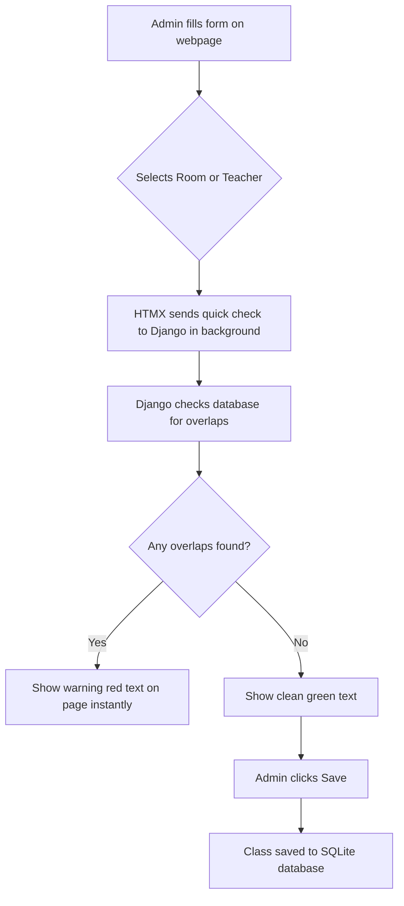

# Timetable Clash Detection — Simple Study Guide for Beginners

Welcome! This guide is written in plain English to help you understand and explain this project in a job interview, even if you are new to coding.

---

## 1. What is this project about? (The Whiteboard Analogy)

Imagine you are in charge of planning the weekly timetable for a college. You have a giant whiteboard, a marker, and sticky notes. 

If you do this manually, you are bound to make three common mistakes:
1. **Teacher Double-Booking:** You accidentally schedule Mr. Smith to teach Class A and Class B at the exact same time. (He cannot be in two places at once!)
2. **Room Double-Booking:** You schedule Math and History in Room 101 at the same time. (They cannot share a single room!)
3. **Too Small Room:** You schedule a Chemistry class of 80 students in a small lab that has only 30 chairs.

**This project is a website that solves these problems.** As you create the timetable, the website automatically checks for these mistakes in the background and warns you *before* you save, so you never make scheduling errors.

---

## 2. The Tech Stack (The Tools Used)

There are **two different versions** of the timetable app built into this project:

### Version A: The Django Web App (Root Folder)
This is the main, fully functional website.
* **Python & Django:** Django is like the "brain" of the website. It handles saving data, checking for conflicts, and creating the web pages.
* **SQLite Database (`db.sqlite3`):** This is a simple database file that acts like a digital Excel sheet, storing all our teachers, rooms, and schedules.
* **HTMX:** A helper tool that makes the website feel fast. When you pick a teacher in the scheduling form, HTMX asks the brain in the background: *"Is this teacher free?"* and shows a warning on the page instantly, without needing a full page reload.
* **Bootstrap:** A library of pre-designed CSS styles that makes our website look neat with clean tables and grid layouts.
* **OpenPyXL:** A Python tool that lets the user download their finalized timetable as a real Excel file with one click.

### Version B: The React App (`smart-timetable-saas/` folder)
This is a modern prototype (draft version) built for the web.
* **React & TypeScript:** A modern way to build highly interactive user interfaces. It runs a step-by-step wizard to set up subjects and teachers.
* **Tailwind CSS:** A modern CSS framework that makes the React app look very premium.
* **Local Storage:** The browser's built-in memory. The React app saves your timetable draft directly inside your Chrome or Edge browser, meaning it can work offline without any database.

---

## 3. How the Database is Structured (The Tables)

To build a timetable, we need to store different pieces of information. We do this using tables (called **Models** in Django):

1. **Department:** A branch of the college (e.g., *Computer Science*, *Mechanical Engineering*).
2. **Faculty (Teacher):** The teachers (e.g., *Dr. John*, *Professor Sarah*), each belonging to a Department.
3. **Room:** The classrooms, storing their name and how many chairs they have (**capacity**).
4. **Course (Subject):** The subjects being taught (e.g., *Python 101*, *Calculus*), storing how many students are expected to attend.
5. **TimeSlot:** The days (Monday to Saturday) and times (e.g., *9:00 AM to 10:30 AM*).
6. **Section (The Scheduled Class):** This is the master sticker that ties everything together. A Section links:
   * 1 Course + 1 Teacher + 1 Room + 1 TimeSlot + a specific Semester.

---

## 4. How the "Double-Booking" Logic Works (The Math)

The core code that checks if two classes clash is in the file [clash_detector.py](file:///c:/Users/Tanu/Timetable-clasher/timetable/clash_detector.py).

### The Overlap Formula
To see if two classes (Class A and Class B) happen at the same time on the same day, we check:
```python
day1 == day2 and start1 < end2 and start2 < end1
```

### Let's understand this with an example:
* **Class A:** 9:00 AM to 10:30 AM (Start = 9:00, End = 10:30)
* **Class B:** 10:00 AM to 11:30 AM (Start = 10:00, End = 11:30)

Do they clash? Let's check:
1. Are they on the same day? **Yes.**
2. Is Class A's start time (9:00) before Class B's end time (11:30)? **Yes.**
3. Is Class B's start time (10:00) before Class A's end time (10:30)? **Yes.**

Since all conditions are **Yes**, they overlap! The code flags a clash.

### Why do we use strictly less-than (`<`) and NOT less-than-or-equal (`<=`)?
Imagine **Class A** is 9:00 AM to 10:00 AM, and **Class B** is 10:00 AM to 11:00 AM. 
These are back-to-back classes. If we used `<=`, the computer would think they clash because they both touch 10:00 AM. By using `<`, the computer knows they are safe back-to-back classes and does not raise a false alarm!

---

## 5. Top 10 Interview Questions & Easy Answers

Here are the questions interviewers love to ask, with simple, plain-English answers you can memorize:

### Q1: How does the clash detection work?
> **Answer:** "It checks if two classes are scheduled on the same day and their times overlap. It checks this for classrooms (to avoid room double-booking) and for teachers (to avoid teacher double-booking)."

### Q2: Why did you use strict `<` instead of `<=` in your overlap code?
> **Answer:** "To allow back-to-back classes. If Class A ends at 10:00 AM and Class B starts at 10:00 AM, they don't overlap. Using strict `<` keeps them valid, whereas `<=` would incorrectly flag a conflict."

### Q3: What is HTMX and why is it used?
> **Answer:** "HTMX is a tiny JavaScript library. It lets us check for conflicts in the background. When an admin selects a teacher or room on the form, HTMX sends the data to the backend and displays clash warnings instantly, without reloading the whole page."

### Q4: How did you optimize the database queries?
> **Answer:** "I used Django's `select_related()` function. Normally, Django makes separate database queries to fetch details like Teacher Name, Course Name, and Room Name for every single class cell. `select_related()` fetches all of them in a single query using SQL joins, making the page load much faster."

### Q5: What database indexes did you add?
> **Answer:** "I added indexes on the Section table for `('room', 'semester')` and `('faculty', 'semester')`. Since these are the columns we search most often to check for clashes, the indexes act like an index at the back of a textbook, letting the database find records instantly without scanning the whole table."

### Q6: What happens when a user edits a class? How do you prevent it clashing with itself?
> **Answer:** "When editing, we exclude the current class's ID from our database search. If we didn't do this, the system would compare the updated class with its own saved version in the database and say: *'Error! This class clashes with itself!'*"

### Q7: What is the difference between the Django app and the React app?
> **Answer:** "The Django app is the complete, database-backed website. The React app is a modern, offline-first visual prototype that saves data in the browser's local storage and runs a setup wizard."

### Q8: What happens if a class has more students than the room capacity?
> **Answer:** "The code checks if the expected student strength of the Course is greater than the Room's capacity. If it is, the system shows a warning, but we allow admins to override it because sometimes they might add extra chairs."

### Q9: What is the benefit of using SQLite?
> **Answer:** "SQLite is a zero-configuration database that saves everything into a single local file (`db.sqlite3`). This makes it extremely easy to set up, run, and test the project locally without installing heavy database servers like MySQL or PostgreSQL."

### Q10: If you had more time, what would you improve in this project?
> **Answer:** "I would do two things: First, I would write the overlap check directly in database queries instead of loading records into Python memory. Second, I would activate the Unavailability checks so that teachers aren't scheduled when they're marked unavailable."

---

## 6. Project Flow (How a class gets scheduled)


